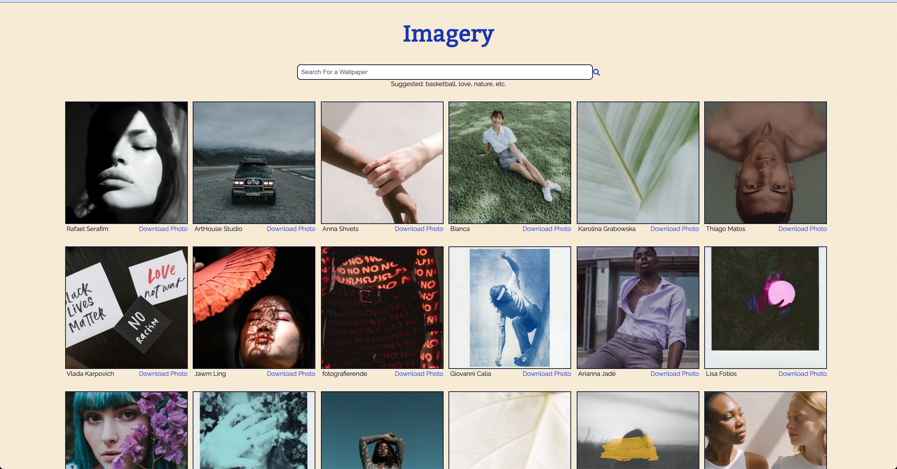

Imagery

Screenshots:

Motivation: 
I wanted to create an app where a user could find curated photos from photographers and follow the photographer's page or download their photos.

Features:

* View currated photos from photographers that are updated regularly
* Seach for images by topic
* View the photographer page for any given photo
* Download image

API:

<a>hre</a>
